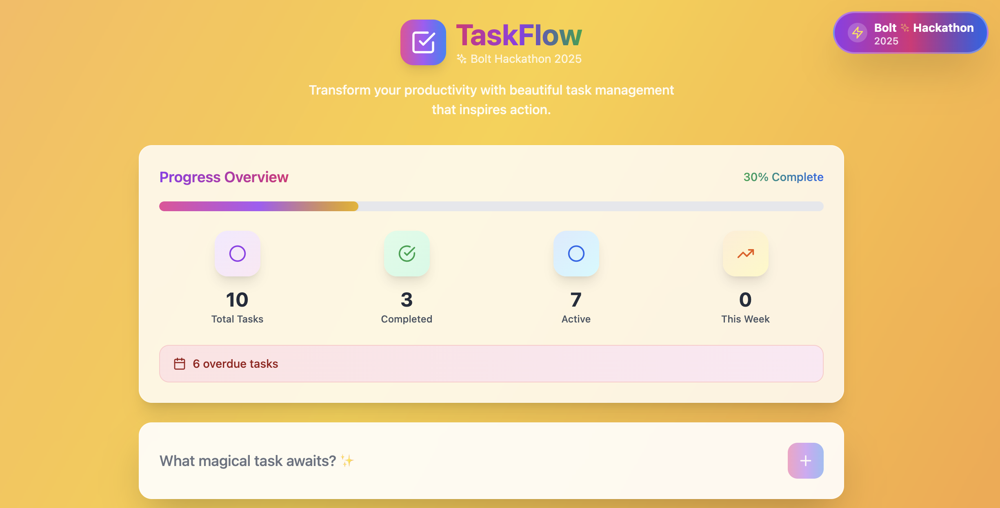
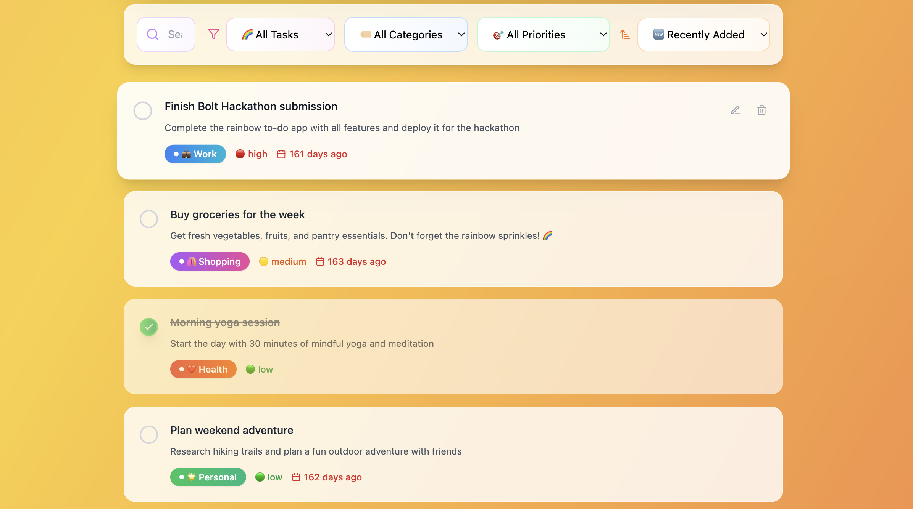
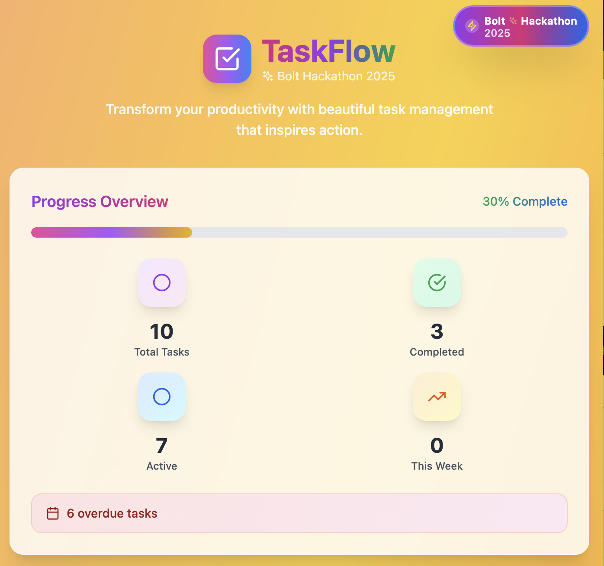

# TaskFlow ✨

> **A beautiful, production-ready task management app built for the Bolt Hackathon 2025**

Transform your productivity with TaskFlow - a stunning rainbow-themed to-do application that combines powerful functionality with delightful user experience. Built with React, TypeScript, and Tailwind CSS.

## 🌈 Screenshots

### Main Dashboard

*Beautiful rainbow gradient background with comprehensive task management*

### Task Management Interface

*Intuitive task creation and organization with priority levels and categories*

### Responsive Design

*Mobile-first responsive design that works perfectly on all devices*

## ✨ Features

### 🎨 **Beautiful Design**
- **Rainbow animated background** with smooth gradient transitions
- **Glass-morphism UI elements** with backdrop blur effects
- **Responsive design** that works perfectly on all devices
- **Smooth animations** and hover effects throughout
- **Production-ready aesthetics** worthy of any modern application

### 📊 **Comprehensive Stats Panel**
- **Progress overview** with rainbow progress bar
- **Real-time statistics** showing total, completed, and active tasks
- **Weekly completion tracking** to monitor productivity trends
- **Due date alerts** for overdue and today's tasks
- **Visual indicators** with colorful icons and gradients

### ✅ **Advanced Task Management**
- **Priority indicators** with colorful emojis (🔴 High, 🟡 Medium, 🟢 Low)
- **Category organization** with gradient badges (💼 Work, 🌟 Personal, 🛍️ Shopping, ❤️ Health)
- **Due date tracking** with smart date formatting
- **Task descriptions** for detailed planning
- **Inline editing** with smooth transitions
- **One-click task completion** with satisfying animations

### 🔍 **Powerful Filtering & Search**
- **Real-time search** across task titles and descriptions
- **Category filtering** to focus on specific areas
- **Priority-based filtering** to tackle important tasks first
- **Status filtering** (All, Active, Completed)
- **Multiple sorting options** (Recent, Due Date, Priority, Alphabetical)

### 💾 **Smart Data Persistence**
- **Local storage integration** to save your tasks
- **Sample tasks included** to showcase features immediately
- **Automatic saving** whenever tasks are modified
- **Data recovery** with error handling

### 🎯 **User Experience Excellence**
- **Intuitive interface** that requires no learning curve
- **Contextual actions** that appear on hover
- **Keyboard shortcuts** for power users
- **Accessibility considerations** with proper contrast and focus states
- **Mobile-first responsive design**

## 🚀 Getting Started

### Prerequisites
- Node.js 18+ 
- npm or yarn

### Installation

1. **Clone the repository**
   ```bash
   git clone <repository-url>
   cd taskflow
   ```

2. **Install dependencies**
   ```bash
   npm install
   ```

3. **Start the development server**
   ```bash
   npm run dev
   ```

4. **Open your browser**
   Navigate to `http://localhost:5173` to see TaskFlow in action!

## 🛠️ Built With

- **React 18** - Modern React with hooks and functional components
- **TypeScript** - Type-safe development for better code quality
- **Tailwind CSS** - Utility-first CSS framework for rapid styling
- **Vite** - Lightning-fast build tool and development server
- **Lucide React** - Beautiful, customizable icons
- **Local Storage API** - Client-side data persistence

## 🎨 Design Philosophy

TaskFlow embraces a **rainbow aesthetic** that brings joy to productivity. Every interaction is designed to feel delightful, from the smooth animations to the carefully crafted color gradients. The app follows modern design principles:

- **Visual Hierarchy** - Clear information architecture
- **Consistent Spacing** - 8px grid system throughout
- **Accessible Colors** - High contrast ratios for readability
- **Micro-interactions** - Subtle animations that provide feedback
- **Progressive Disclosure** - Advanced features revealed contextually

## 🏆 Hackathon Features

Built specifically for the **Bolt Hackathon 2025**, TaskFlow showcases:

- ⚡ **Rapid Development** - Built with modern tooling for fast iteration
- 🌈 **Creative Design** - Unique rainbow theme that stands out
- 📱 **Mobile-First** - Responsive design for all devices
- 🔧 **Production-Ready** - Clean code architecture and error handling
- ✨ **User Delight** - Thoughtful animations and interactions

## 📝 Usage

1. **Add Tasks** - Click the input field and describe your task
2. **Set Priorities** - Choose from High (🔴), Medium (🟡), or Low (🟢)
3. **Organize by Category** - Assign tasks to Work, Personal, Shopping, or Health
4. **Set Due Dates** - Add deadlines to stay on track
5. **Track Progress** - Watch your completion stats grow
6. **Filter & Search** - Find exactly what you need quickly

## 🤝 Contributing

This project was built for the Bolt Hackathon 2025. Feel free to fork and extend it with your own creative ideas!

## 📄 License

MIT License - feel free to use this code for your own projects!

---

<div align="center">

**Built with 🌈 for the Bolt Hackathon 2025**

*Powered by React & Tailwind CSS*

</div>